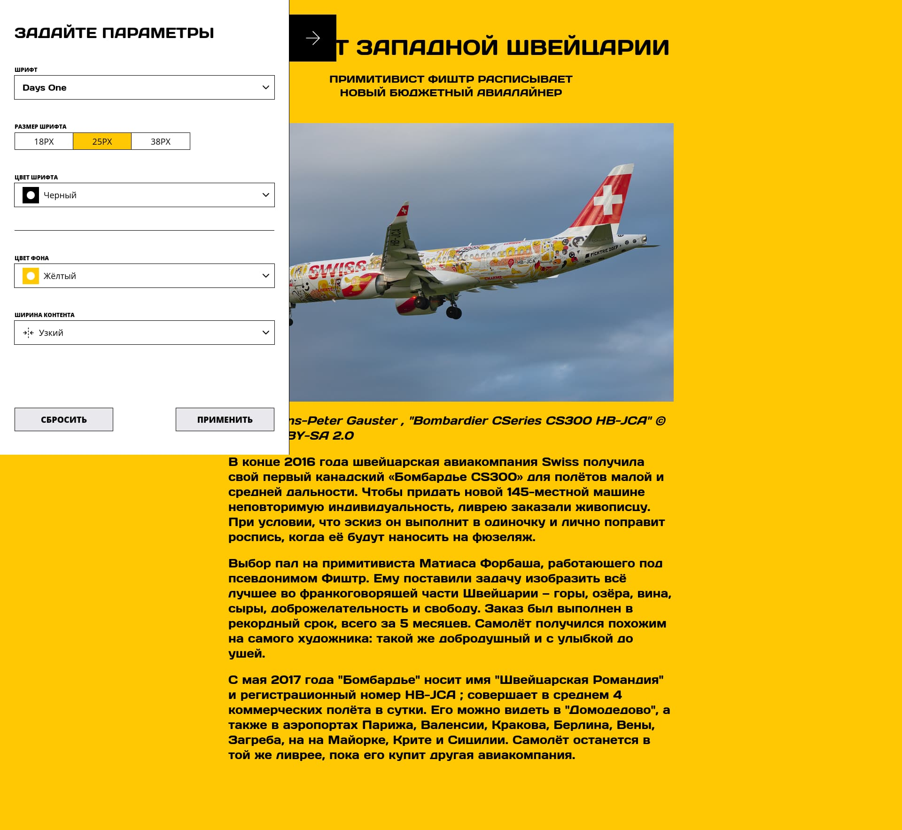

https://github.com/MikeBeloborodov/blog-customizer

# Проектная работа "Blog Customizer"

## Оглавление

- [Запуск](#запуск)
- [Сборка](#сборка)
- [Описание](#описание)
- [Скриншоты](#скриншоты)
- [Автор](#автор)
- [Благодарность](#благодарность)

## Запуск

Для установки и запуска проекта необходимо выполнить команды

```
npm install
npm run start
```

или

```
yarn
yarn start
```

## Сборка

```
npm run build
```

или

```
yarn build
```

## Описание

Блог с сайдбаром, в котором можно кастомизировать отображение.

Стек: React, SCSS, TS, Webpack

Структура проекта:

- src/ — исходные файлы проекта
- src/components/ — папка с React компонентами

Важные файлы:

- src/index.html — HTML-файл главной страницы
- src/types/index.tsx — входная точка приложения
- src/styles/styles.scss — корневой файл стилей
- src/constants/ - папка с константами приложения

## Скриншоты




## Автор

- Github - [MikeBeloborodov](https://github.com/MikeBeloborodov)
- Frontend Mentor - [@MikeBeloborodov](https://www.frontendmentor.io/profile/MikeBeloborodov)

## Благодарность

Благодарю команду Яндекс Практикум за предоставление дизайна и уроков!
